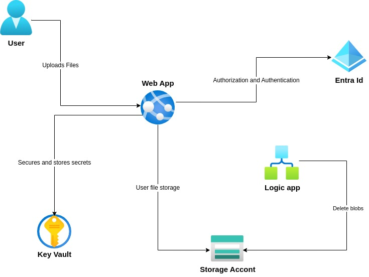

# FileShare - A Secure File Sharing Application

## Description

FileShare is a secure file-sharing application built using Flask and integrated with Azure services. It allows users to share files securely, leveraging Azure Blob Storage, Azure Logic Apps, Azure Key Vault, and Entra ID for enhanced functionality and security.

## Architecture

    

## Features

1. **File Uploads:** Supports file uploads up to 1GB.
2. **OTP Verification:** Ensures secure uploads with OTP verification before processing files.
3. **File Compression:** Zips and encrypts uploaded files using AES encryption to optimize storage and enhance security.
4. **Secure Sharing:** Generates Shared Access Signature (SAS) links for secure file sharing via email, and the password of the zip file is shared.
5. **Auto Cleanup:** Uses Azure Logic Apps to delete blobs older than 6 hours.
6. **Secret Management:** Uses Azure Key Vault to store and retrieve application secrets securely.
7. **Scalable Hosting:** Deployed as an Azure Web App for scalability and reliability.

## Tech Stack

- **Backend Framework:** Flask (Python)
- **Cloud Platform:** Microsoft Azure
- **Storage:** Azure Blob Storage
- **Security:** Azure Key Vault, Entra ID
- **Automation:** Azure Logic Apps

## Azure Services Used

1. **Azure Blob Storage:** Stores uploaded files which are zipped.
2. **Azure Logic Apps:** Schedules and automates deletion of files older than 6 hours.
3. **Azure Key Vault:** Manages and secures secrets (e.g., connection strings, API keys).
4. **Entra ID:** Provides secure app registration and secret storage integration.
5. **Azure Web App Service:** Hosts and runs the Flask application.

## Usage

1. Navigate to the [hosted web app](https://mf31-fileshare.azurewebsites.net/).
2. Upload files (max size: 1GB).
3. Verify upload using OTP verification.
4. After verification, files are uploaded to Azure Blob Storage.
5. SAS link is generated and sent to specified users via email.

## File Cleanup Process

- Blobs older than 6 hours are automatically deleted by the Azure Logic App.

## Security Measures

- All secrets are securely stored in Azure Key Vault.
- OTP verification ensures secure uploads before processing files.
- Files are accessible only through time-limited SAS links shared via email. The SAS link expires after 6 hours.
- Files are accessible with password protection for added security.

## Follow me and Star ⭐ the Repository
